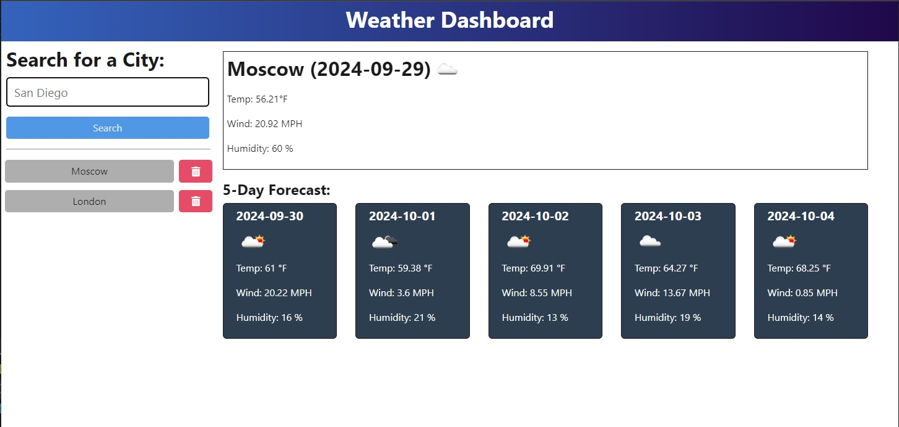

# WeatherForecast-WebApp
 
## Description
The Weather Dashboard is a web-based application that allows users to search for the current weather and a 5-day forecast for any city. It uses the OpenWeather API to fetch weather data based on the city's geographical coordinates. The app also saves search history with persistent storage, so users can quickly retrieve weather information for previously searched cities. Users can also delete cities from the search history if desired.

### Key Features:
- Search for city weather: Provides current weather and 5-day forecast data for any city.

- Persistent search history: Stores search history so users can easily retrieve weather data for previously searched cities.

- Weather details: Displays temperature, humidity, wind speed, and weather conditions for the selected city.

- Delete search history: Allows users to remove cities from the search history.

Table of Contents
- [Installation](#installation)
- [Usage](#usage)
- [License](#license)
- [Questions](#questions)

## Installation
1. Clone the repository to your local machine:
```
git clone https://github.com/<your-username>/weather-dashboard.git
```

2. Navigate to the project directory:
```
cd weather-dashboard
```

3. Install the necessary dependencies:
```
npm install
```

4. Create a .env file in the server directory to store the URL and your API key:
```
API_BASE_URL=https://api.openweathermap.org
API_KEY=your_openweather_api_key
```

5. Run the application locally:
```
npm run start
```

## Usage
Open the application in your browser.
Use the search bar to enter a city name.
View the current weather and 5-day forecast for the selected city.
Click on a city in the search history to quickly view weather information.
Use the delete button next to a city in the history to remove it.

### Example Screenshot


## License
This project is licensed under the MIT License.

## Questions
For any inquiries or issues, please contact:

- Name: Owen Kenne
- Email: <okenne.devworks@gmail.com>
- GitHub: [O-KenneDevWorks](https://github.com/O-KenneDevWorks)
